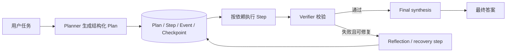
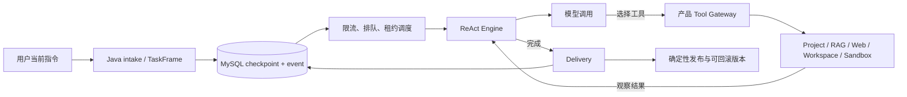

# Agent 链路演进、持久化与评测

本文只记录仓库中已经存在并经过代码或运行验证的事实，用于架构评审和面试复盘。

## 为什么从 Plan-and-Execute 转向 ReAct

旧链路不是概念 Demo。它已经实现了规划、持久化步骤、依赖执行、结果校验、失败修复、租约恢复和最终汇总。但它把一个用户任务拆成多个模型阶段，阶段之间通过严格结构化数据交接：规划器先生成 Plan，执行器按步骤运行，校验器判断结果，失败时再生成修复步骤，最后还要重新汇总。

这带来三个实际问题：

1. 每个阶段都会增加模型调用、首结果延迟和 token 消耗；
2. 规划 JSON、工具参数、文件标识和证据必须跨阶段保持一致，任一阶段丢字段都会造成后续失败；
3. “步骤已完成”不等于“最终答案满足原始问题”，信息可能在最终汇总时丢失。

当前产品因此选择 ReAct 作为主链：模型根据当前任务和已观察结果逐步选择工具，确定性控制面负责鉴权、幂等、持久化、调度、恢复、取消、沙箱与发布。这里放弃的是复杂的模型 Plan 协议，不是可靠性保证。

## 两条真实链路

### 历史持久化 Plan-and-Execute

已实现能力：

- `agent_plans` 保存目标、状态、原始 Plan、权威答案和 checkpoint；
- `agent_plan_steps` 保存步骤顺序、依赖、工具上限、成功标准、尝试次数和结果；
- `agent_plan_events` 追加记录事件，并通过幂等键防止恢复时重复写入；
- Plan 使用 owner、token、fence、过期时间和 heartbeat 实现租约；
- 服务启动和定时扫描会恢复租约过期的未完成 Plan；
- 单步骤最多尝试 2 次，恢复会追加替代步骤，不能改写已完成的权威事实；
- 沙箱执行、Receipt、ProjectVersion 和最终答案有额外绑定与校验。

### 当前 ReAct 主链

当前已实现能力：

- DeepSeek、GLM 和自定义 Provider 路由；
- 最近完整对话、较早对话摘要、长期记忆和知识库检索；
- Web 搜索，以及项目读取、搜索、修改、沙箱验证、自动发布和回滚相关工具；
- 工具目录与 Schema 延迟加载：模型先看到精简目录，调用 `load_tool` 后才允许执行；
- Task、单调事件、模型完成结果、沙箱执行和 token 结算持久化；
- 服务重启恢复、SSE 断线补事件、取消、全局/单用户并发限制和多实例租约；
- 模型或 Gateway 的短暂失败最多总计尝试 3 次，仅重试可重试的传输错误和 5xx；4xx 不重试，同一请求保持相同请求体和幂等标识。

尚未完成或不能写成“已实现”的能力：

- MCP 服务目录和 Skills 注册代码存在于产品中，但尚未作为通用能力接入当前 ReAct 工具循环；
- 当前持久化的 V2 Plan 是确定性单步外壳，不是模型生成的动态多步骤 Plan；
- Provider 不可用时的跨 Provider 自动降级还没有形成完整策略；
- 真实任务评测已有固定集合和运行器，但仍需持续扩充不同学科与复杂项目样本。

## 关键持久化数据

| 数据 | 主要表 | 作用 |
|---|---|---|
| 历史 Plan | `agent_plans` | 生命周期、checkpoint、租约、恢复状态、权威答案 |
| 历史步骤 | `agent_plan_steps` | 依赖、工具上限、尝试次数、步骤结果 |
| 历史事件 | `agent_plan_events` | append-only 过程与幂等恢复 |
| ReAct 请求入口 | `reactplan_turn_intakes` | 用户、会话、请求摘要、turnId、taskId 幂等绑定 |
| ReAct 任务 | `reactplan_task_checkpoints` | 状态、checkpoint、事件序号、token 结算、取消和租约 |
| ReAct 事件 | `reactplan_task_events` | SSE 可重放的单调事件流 |
| 模型调用 | `reactplan_model_completions` | 请求摘要、完成状态、响应、耗时与 token 指标 |
| 沙箱执行 | `reactplan_sandbox_executions` | 提交、状态、Receipt 与取消意图 |
| 对话摘要 | `reactplan_conversation_summaries` | 较早历史的异步摘要和覆盖游标 |
| V2 外壳 | `agent_v2_plan_bootstraps` 及租约/执行上下文表 | TaskFrame 到确定性单步 Plan 的可靠控制面 |
| 项目回滚 | `project_revisions`、`project_revision_operations` | 不可变修订及操作记录 |

## 固定 A/B 评测

运行方式见 `agent-engine-reactplan/eval/README.md`，脚本为 `npm run eval:compare`。它针对同一 Project，使用相同的 5 个只读任务，分别调用 ReAct 和历史 Plan 的真实产品 API。评分只看终态和答案是否包含要求的事实，不要求两条链路使用相同工具名。

2026-08-20 的本地真实运行结果：

| 指标 | ReAct | 历史 Plan |
|---|---:|---:|
| 通过任务 | 5 / 5 | 2 / 5 |
| 平均端到端耗时 | 17,931 ms | 30,703 ms |
| 5 个任务总 token | 71,896 | 不可准确统计 |

历史 Plan 的 3 个失败均为 Plan 状态已经 `COMPLETED`，但最终答案漏掉用户要求的精确路径或算法关键词。这不是对所有模型和任务的普遍结论，只是一次可复现的小样本结果。它支持当前决策：先用更短的 ReAct 数据路径获得基本可用性，再按真实评测补复杂规划能力。

旧 Plan 的 token 留空是有意的：历史实现没有把 planner、executor、verifier、reflection 和 final synthesis 的所有使用量汇总成一个公开指标。不能拿不完整数字和 ReAct 的完整 Trace 做伪精确比较。

## 面试时的一分钟说法

项目早期采用持久化 Plan-and-Execute，Plan、步骤和事件都存 MySQL，并通过 checkpoint、租约 fencing、心跳和启动扫描支持恢复；执行阶段还有步骤校验、有界重试和失败后追加修复步骤。链路能够运行，但多模型阶段使 token、延迟和结构化交接成本过高，最终汇总还可能遗漏步骤中已经得到的事实。

因此我把在线主链切换为 ReAct：模型每轮依据当前观察选择下一工具，Java 控制面继续负责权限、幂等、持久化、调度、取消、沙箱 Receipt、自动发布和回滚。真实 5 任务对照中，ReAct 通过 5 个、平均约 17.9 秒，历史 Plan 通过 2 个、平均约 30.7 秒。现在优先补 MCP、Skills、Provider 降级和更大的评测集，而不是重新引入复杂的模型 Plan JSON。
